**Postman to Configure UEFI Redfish**

**1. About**

**Postman** is a free and most-used REST client worldwide. The download link is
*"https://www. getpostman.com/"*.

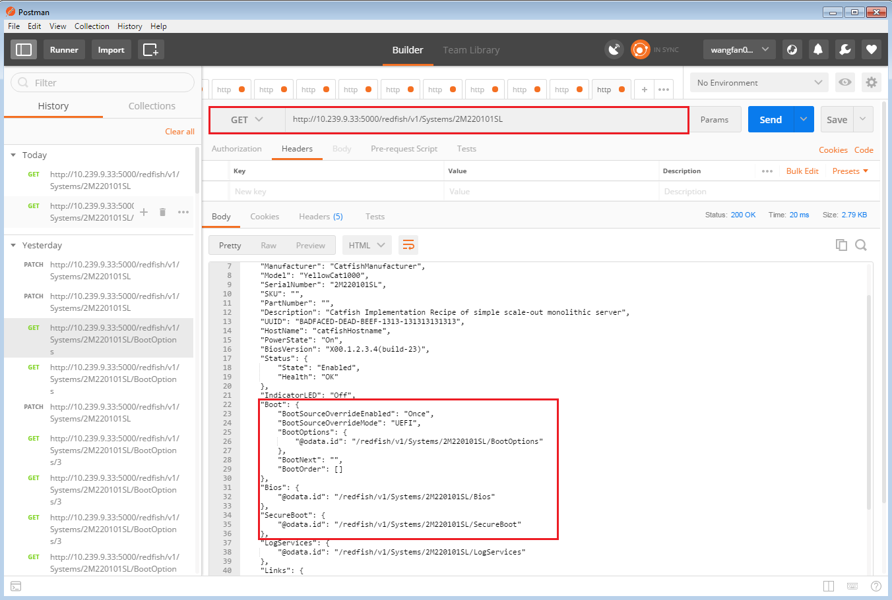

Below chapters show some examples about configuring **UEFI iSCSI initiator** 
and **UEFI Boot Option** via the Redfish service. Postman is used as the interface
for Redfish users to communicate with the Redfish Server.

**Note**: For GET/PATCH methods in Postman, please *enable the "Authorization"*
and *select the "Basic Auth" type*. The Redfish-Profile-Simulator has a
limitation that the *user/password for "Basic Auth" is hardcode as
"admin/pwd123456",* which means the Username in Postman must be "admin" and the
Password must be "pwd123456".

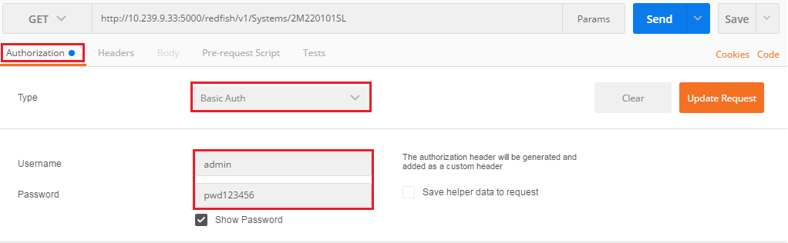

This document assumes that readers have some basic knowledge to setup
**Redfish-Profile-Simulator** and **NT32 Platform** (Refer section "HOW TO RUN
UEFI REDFISH CLIENT WITH REDFISH SERVER" in release note).

**2. Usage Example: Configure UEFI iSCSI initiator**

**2.1 Retrieve Current UEFI Keyword Settings**

The Redfish user should retrieve the supported UEFI configuration keywords
(**AttributeRegistry**) from the Redfish Server first. Use Postman to GET this
AttributeRegistry from the URL *"http://
xxx.xxx.xxx.xxx:5000/redfish/v1/Registries/BiosAttributeRegistryUefiKeyword.v1_0_0".*

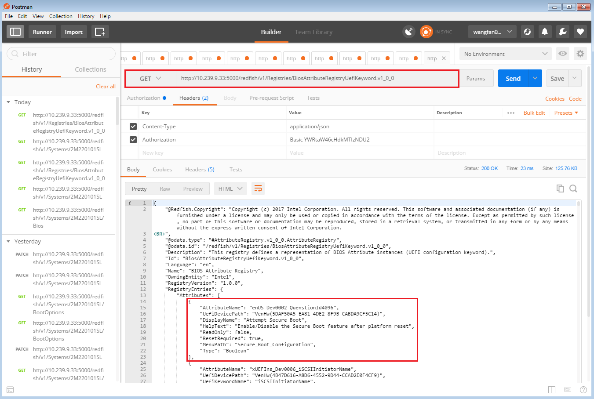

**2.2 Patch Settings to Redfish Server**

The pending settings should be patched to the URL
*"http://xxx.xxx.xxx.xxx:5000/redfish/v1/ Systems/2M220101SL/Bios/Settings"*.

The **PATCH** method should be selected in Postman, and the Headers of the PATCH
message should include the following parts：

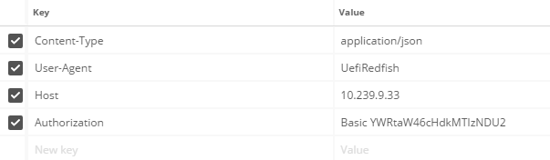

The Body of the PATCH message can be included in the **raw column** and all of
its attribute keys should be able to be referred in AttributeRegistry. Assume
that AttributeRegistry retrieved from the Redfish Server is as following:

"RegistryEntries": {

"Attributes": [

{

"AttributeName": "xUEFIns_Dev0006_iSCSIInitiatorName",

>   ...

},

{

"AttributeName": "xUEFIns_Dev0006_iSCSIMacAddr",

>   ...

},

{

"AttributeName": "xUEFIns_Dev0006_iSCSIAddAttempts",

>   ...

},

{

"AttributeName": "xUEFIns_Dev0006_iSCSIAttemptName2",

>   ...

},

>   ...

]

}

Above "AttributeName" should be used as the key of the settings, and each value
depends on the actual configurations. Here is an example of **"Attributes"** to
be patched to the Redfish Server according to the above AttributeRegistry:

**2.3 Reboot UEFI platform**

Above pending settings will be applied to the UEFI iSCSI initiator during the
system reboot. The applied platform configuration will also be synchronized to
the Redfish Server. Redfish users can get the configuration result from
*"http://xxx.xxx.xxx.xxx:5000/redfish/v1/Systems/2M220101SL/ Bios":*

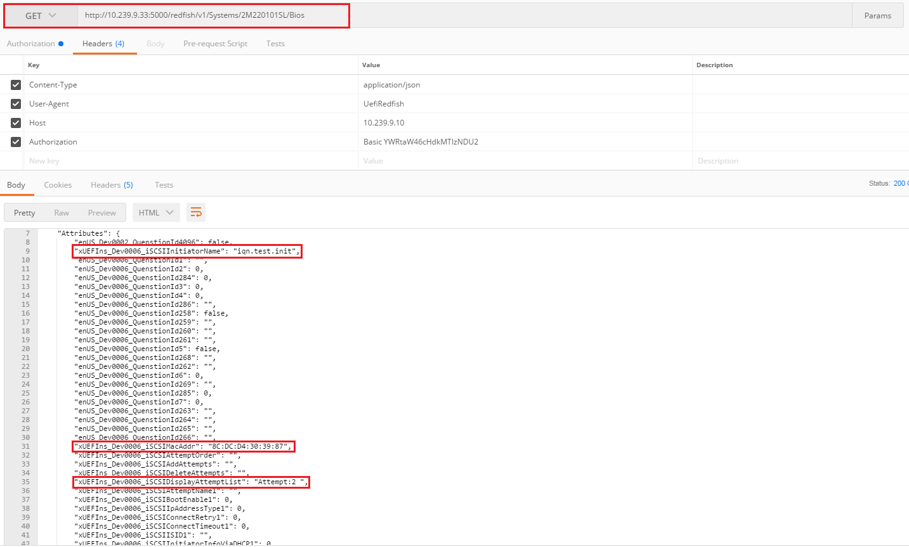

And can also check the UEFI iSCSI initiator configuration under **"Device
Manager-\>iSCSI Configuration"**:

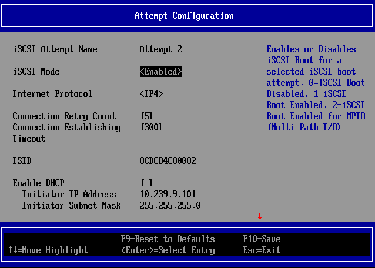

**3. Usage Example: Configure UEFI Boot Options**

**3.1 Retrieve current Boot Option settings**

There are two configurable Boot Option properties in Boot settings:
**"BootNext"** and **"BootOrder".** The Redfish user should retrieve current
Boot settings from the Redfish Server first by getting resource from
"http://*xxx.xxx.xxx.xxx*:5000/redfish/v1/Systems/2M220101SL" using Postman.

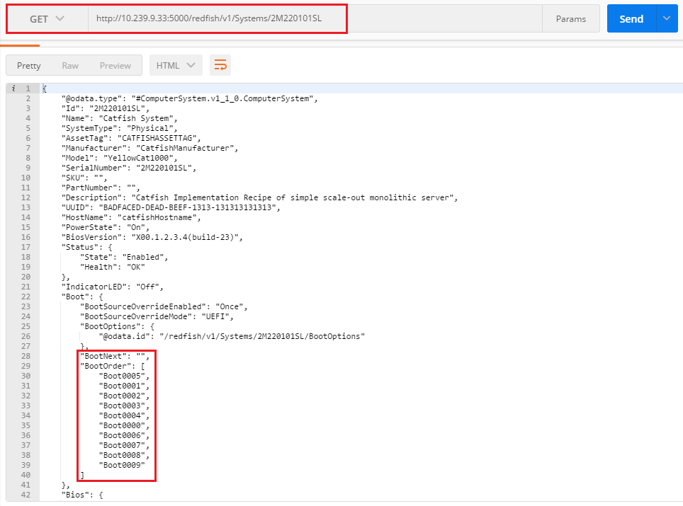

**Note**: These boot information will be available only after NT32 platform has
startup and synchronized with the redfish server at least one time.

**3.2 Patch settings to Redfish Server**

The Redfish user can patch the Boot Option settings to the Redfish Server
according to the Boot Option Schema. All of the configurations should be patched
to the URL *"http://xxx.xxx.xxx.xxx: 5000/redfish/v1/Systems/2M220101SL"* by
Postman.

The **PATCH** method should be selected, and the Headers of the PATCH message
can include the following parts：

Boot Option settings can be changed by **"BootNext"** property, but *it takes
effect only once and will be reset to empty after next time’s boot*. The Body of
the PATCH message should be included in the **raw column**:

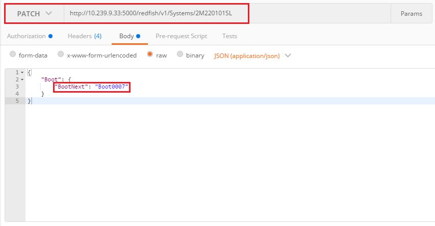

If the Redfish user expects *a permanent change* on Boot Options, the
**"BootOrder"** property should be patched to the Redfish Server. The Body of
the PATCH message should be included in the **raw column**:

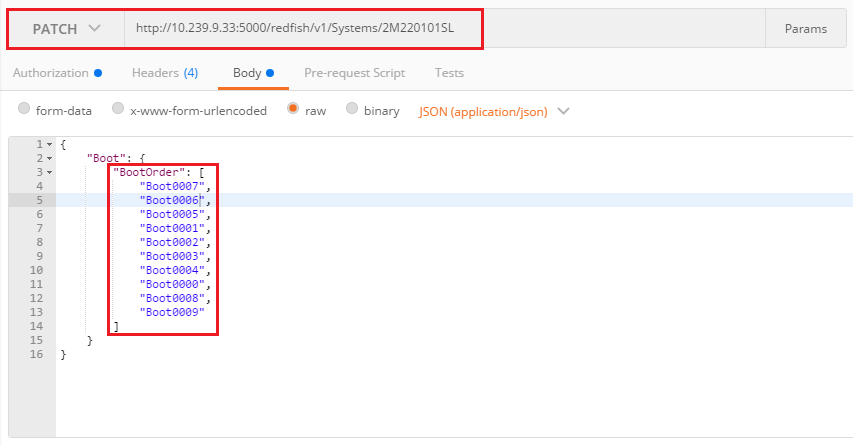

**3.3 Reboot UEFI platform**

The above configurations on **"BootNext"** or **"BootOrder"** will be applied to
the UEFI Boot Option settings during the system reboot. The Boot method will be
changed to the set Boot Option defined.

The applied boot next configuration will be reset to empty, and the applied boot
order configuration will be synchronized to the Redfish Server. The Redfish user
can also get the boot order setting result from
"*http://xxx.xxx.xxx.xxx:5000/redfish/v1/Systems/ 2M220101SL*".

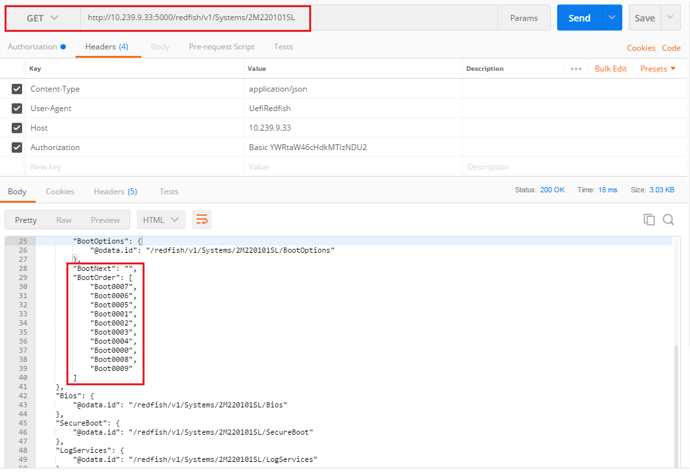

**3.4 Reboot from expected booting method**

**Reboot system again**, we can observe the booting method has been changed. The
Redfish user  
can also verify the BootOrder configuration from checking Boot Options in **Boot
Manager** (**Note**:  
The UiApp Boot Option will not be displayed in Boot Manager), or the command
**bcfg boot dump** in shell.

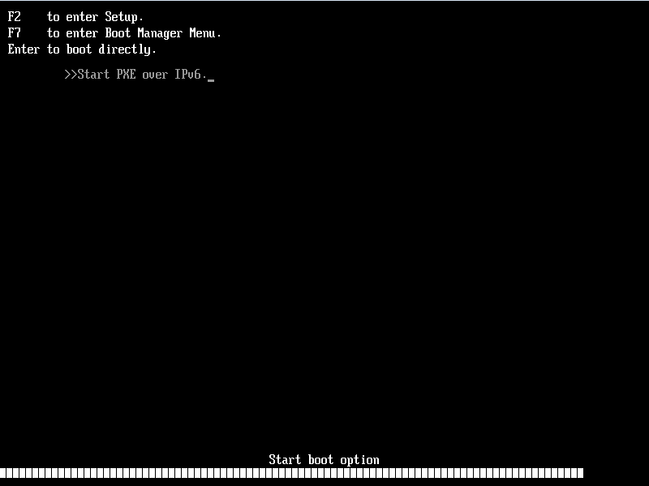
